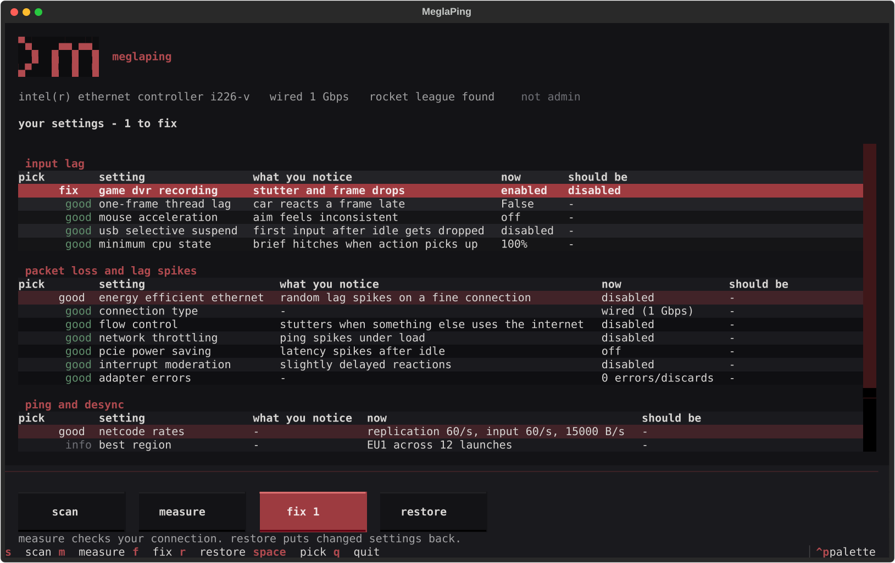

# meglaping

finds and fixes the windows and rocket league settings that cause input lag, packet loss
and rubber-banding, then measures your connection so you can see if it worked.



## what it does

it scans as soon as you open it. every row says what the setting is, **what you notice
when it is wrong**, what it is now, and what it should be.

| key | |
|---|---|
| `s` | scan, changes nothing |
| `m` | measure your connection and score it |
| `f` | fix the settings you picked |
| `r` | restore, put settings back |
| `space` | pick or unpick a row |

every fixable row starts picked. click a row or press space to unpick it, so you only
apply what you want. restore works the same way: pick which settings to put back.

most fixes need administrator rights. press fix without them and meglaping offers to
restart itself elevated.

**restart your pc after applying.** network card settings only take effect once the
adapter restarts, and some windows settings need a reboot.

## what it can and cannot see

nothing outside the game can measure true input lag or desync. what it *can* measure is
ping, jitter, packet loss, path mtu and adapter errors, plus the settings known to cause
those symptoms.

it also refuses to apply popular tweaks that do nothing here. nagle's algorithm and
`tcpackfrequency` only affect tcp, and rocket league's gameplay traffic is udp.

## what it checks

| problem | settings |
|---|---|
| packet loss | energy efficient ethernet, flow control, interrupt moderation, network throttling, pcie power saving |
| input lag | one-frame thread lag, game dvr, mouse acceleration, usb selective suspend, minimum cpu state |
| reported only | wi-fi vs wired, adapter errors, path mtu, vpn on your route, netcode rates, best region |

nothing is hardcoded to one machine. the adapter is whichever carries your traffic,
network settings are read through vendor-neutral ndis keywords, and anything your
hardware does not expose is skipped rather than guessed at.

## restore

every change is written to `%LOCALAPPDATA%\MeglaPing\journal.json` with the value that was
there before. restore puts back *that* value, not a hardcoded default. rocket league
config files are backed up first, and meglaping will not edit them while the game is
running, because it rewrites them on exit.

## how it finds your servers

rocket league logs the addresses it pings, the score it gave each region, and every match
server you joined. meglaping reads those instead of shipping a server list that would go
stale, so it measures the regions you actually play on. join credentials and account ids
are stripped before anything is stored or shown.

region names come from match records where possible. where they are guessed from the
order of the ping list they are marked `?`, because a region that times out drops out and
shifts the names after it.

## scoring

0-100, weighted towards loss and jitter rather than raw ping, because those are what make
the server correct your car. a steady 80 ms scores better than a jumpy 30 ms. every
measurement is saved, so you can measure, fix, and measure again.

## install

```bash
pip install -e .
meglaping
```

python 3.10+, windows only.

## building the exe

```powershell
.\build.ps1
```

gives you a self-contained `dist\MeglaPing.exe` (~16 mb), no python needed. it is
unsigned, so expect a smartscreen warning and the odd antivirus false positive.

## tests

```bash
pip install -e ".[dev]"
pytest
```

## licence

mit.
